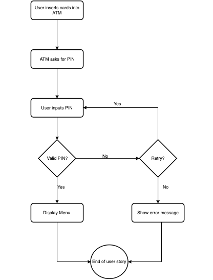
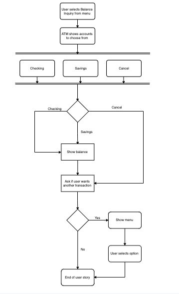
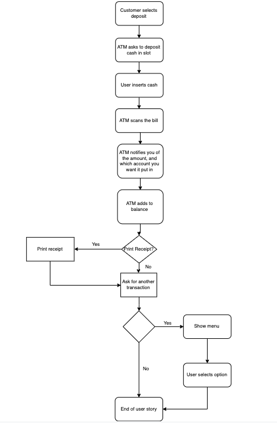
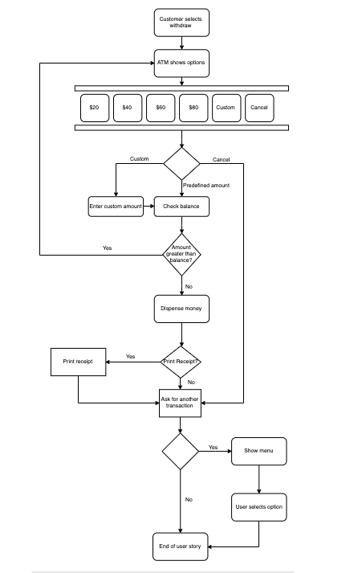

# OOP Design

OOP Design is a good exercise on how to split up our system into different components. It's like React Components before they were cool but instead of React Components, we separate our system into different objects/classes. The main difficulty with problems like these are that they are opened ended and force you to think abstractly and creatively. One of the other main goals of this exercise is to be able to draw out diagrams to help with communicating abstract ideas before they are implemented in code. These problems are language agnostic.

## Design an ATM

Using object oriented programming principles, class diagrams and activity diagrams, design an ATM. We are being explicit here, however, you might not get this luxury from an interviewer as they might just ask, "Using object oriented design, design an ATM".

## Requirements and Goals of an ATM

This part is not necessarily said to the candidate; this is just a reference for the interviewer. The interview starts at Strategy Guide.

- Takes in a card and authenticates user
- User has the option to deposit, withdraw and view balance

## Strategy Guide

### Talk Through User Stories

To start off, ask the question, "What can an ATM do?" Have the candidate walk through a couple of user stories and cosplay as an ATM user.

Appropriate user stories would include:

- *An authentication user story*: User inserts their card into the ATM and they are prompted to enter their PIN. If the PIN is correct, open up a menu. If the PIN is incorrect, the user gets prompted to input it again. After a certain amount of times, you get booted off the system.

- *A deposit user story*: After authentication is done, the user wants to deposit some cash. They will click the "deposit" button (on the screen or using some button), input the amount of cash they are depositing, input PIN, insert cash into cash dispenser, click a confirmation, print receipt, update the amount in their account (in the background), ask if they want to do another transaction.

- *A withdraw user story*: After authentication is done, the user wants to withdraw some cash. They will click the "withdraw" button (on the screen or using some button), input the amount of cash they want to withdraw, input PIN, take cash from the cash dispenser, print receipt, update the amount (in the background), ask if they want to do another transaction.

- *A balance inquiry user story*: After authentication is done, the user wants to see a summary of their balance. They will click the "balance inquiry" button (on the screen or using some button), they are brought to some screen with a total balance shown on it, ask if they want to do another transaction.

*Note 1*: These can get very involved so feel free to reel the candidate back in by having them prune some of the story or to make the interaction a little more basic.

*Note 2*: It is appropriate to bring up account here because each one of the user stories has to interact with an account. See if you can get them to speak about different types of accounts. It is also okay to have them run through it without thinking about multiple accounts and just have one main account. This can be a talking point later on towards the end of the interview.

*Note 3*: Table checks and only use cash in this section. If you have time, bring it back up for conversation near the end.

*Minimum Solution*: The goal is to get them to talk through at least 2 of these at the minimum. The ideal 2 are deposit and withdraw. Encourage them to think about others but if it goes a little too long, then move on to the next section and you can come back to this later.

### Draw Activity Diagrams

The next step is turn that chat about the user stories into activity diagrams or flow charts. It's not enough to just talk about it, we need to document it for our theoretical team.

#### Authentication Activity Diagram

#### Balance Inquiry Activity Diagram

#### Deposit Activity Diagram

#### Withdraw Activity Diagram

*Note 1*: Just as in the previous section, at least 2 (withdraw and deposit) would be fine here.

### List/Talk About the Main Components of an ATM

After they are done with the activity diagrams, it's time to have them think about the main components of an ATM. This usually means the possible physical parts. Sometimes developers skip over this in interviews and just go straight for something like an account class, which is a viable class but we want to illustrate something more. The reason we do this is to demonstrate the idea that OOP is predicated on mapping some "real world object" to a classes and subclasses. It is ideal that you don't reveal that physical parts of an ATM can map to their own (possible) classes in this section. A nice strategy here is to have them draw an ATM. It is likely they might have used one recently so it gives them something to latch on to. However, maybe they can't think about the ATM or just haven't used one in a while. Then, it would be good for them to draw out how their interactions in the activty diagrams would work on an ATM they are building from scratch.

*Full Solution*:

- ATM
- Card reader
- Keypad
- Screen
- Cash dispenser
- Deposit slot
- Receipt slot
- Network infrastructure (for authentication, updating balance, etc.)

*Minimum Solution*: Depending upon how much of the activity diagrams they get above and their current working model of how an ATM works, the minimum amount of components to identify are the cash dispenser, the keypad OR screen, and ATM. Sometimes, candidates might do one slot for all the functionality.

### Classes of an ATM System

By this point, the board should be filled with a lot of references for the candidate to be able to discuss and list the main classes of an ATM system.

*Full Solution*:

- ATM: Can have an ATMID to distinguish it from other ATMs as well as a location as properties
- Keypad: Where we enter PIN or amounts
- Screen: Different screens and messages shown; could be a touch screen ATM
- Printer: Print receipts
- CashDispenser: The ATM component that dispenses cash
- DepositSlot: The ATM component that accepts cash
- Bank: Which bank owns the ATM/holds customer account info
- CardReader: The ATM component that reads the magnetic strip
- Account: User account information
    - Checking extends Account
    - Savings extends Account
- Customer: General user information
- Card: The actual card
- Transaction: What type of transaction it can be
    - Deposit extends Transaction
    - Withdraw extends Transaction

*Minimum Solution*:

- Account
- ATM
- Keypad OR Screen
- Slot
- Deposit
- Withdraw

*Note 1*: A conversation point here is the transaction class. We can have this as a "main class" and deposit and withdraw can "extend" it. This can actually be extend (ha) to the account class. It can be the main class and savings and checking account can extend it. Encourage them to think about this by kind of throwing it out there: "For deposit, can't we generalize that somehow?" And start a conversation about it. Also, give a candidate room to defend themselves. You can absolutely challenge their notions but they can also defend their idea of why something may work. It's a viable solution to have deposit and withdraw as their own classes but one of the goals of OOP design is abstraction.

*Note 2*: Account and Customer can either be combined or separated. Either works. However, a good conversation point is that maybe we want account information to be private. JavaScript doesn't offer "traditional" privacy like class based OOP languages like Java and C++ which have special keywords to note if a property or method should be private. So, for possible privacy, we might want to hide our entire implementation of Account and separate it from Customer.

*Note 3*: If they get stuck on just the "software-based" classes, throw them a bone by taking a part of their user story (the card is a nice example) and asking them, "Doesn't this have certain properties that we can store in a class?" By that point, they should get that we would like to map out the physical parts of the ATM. If they are still stuck, throw them as many bones as you want.

## Additional Discussion Points

Nearing the end of the problem, we can choose to discuss how might we want to add additional features to our ATM:

- What if we wanted to add a transfer money option?
- What if we wanted to add credit card accounts or investment accounts?
- What if we wanted to deposit checks as well?
- What if we added a "status" functionality to our transactions?
    - Success, Failure
- What if we added a "status" functionality to our customers?
    - Active, Closed

### Actors of an ATM System

Another great talking point to get them thinking about the entire system is to talk about the "actors" of a system. ATMs are physical entities that have limitations. It can't fit unlimited money and doesn't generate its own money if it runs out. So, there are actors in many systems that we don't traditionally think about.

#### Operator

- Turn ATM ON/OFF
- Refill ATM with cash, receipts, ink
- Take out deposited checks and cash

#### Customer

- See Main functionality

#### Bank Admin

- Generate reports based on operator
